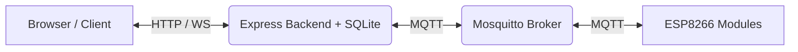

# HomeCore Nexus Control Center

**HomeCore Nexus** is a highly specialized, modular IoT command center designed to run 24/7 on an Orange Pi One. It acts as the central hub for managing ESP8266 hardware modules via MQTT. 

Moving away from the traditional multi-room smart home paradigm, Nexus adopts a **Premium Cyber-Command Center** approach—focusing on raw system telemetry, strict command execution, and real-time observability in a single, immersive dark-themed dashboard.

---

## 🌟 Key Features

* **Advanced Telemetry Dashboard**: Real-time System Load, Memory Usage, and Network Services monitoring (Orange Pi Health).
* **Module Command Center**: Execute strict `pulse`, `on`, and `off` commands with built-in frontend cooldowns to prevent hardware spam.
* **Live Event Stream**: Real-time audit logs of system events, MQTT messages, and user actions.
* **Dashboard Gallery (V1)**: A digital photo frame widget directly embedded in the dashboard, with customizable slide intervals.
* **Deep Diagnostics**: Built-in backend health checks for SQLite latency, MQTT bridge connectivity, and Memory usage.
* **Premium Cyber UI**: A custom-built, responsive glassmorphism dark mode interface utilizing Framer Motion for micro-animations.

---

## 🛠️ Architecture & Tech Stack

### Hardware Target
* **Host**: Orange Pi One (Armbian / Linux)
* **Broker**: Native Mosquitto MQTT (`127.0.0.1:1883`)
* **Network**: Native Pi-hole (`192.168.0.103`)
* **Edge Devices**: ESP8266 NodeMCU / Wemos D1 Mini

### Software Stack
* **Frontend**: React 18 + Vite + TypeScript + TailwindCSS + Framer Motion
* **Backend**: Node.js + Express + SQLite3
* **Realtime**: `ws` (WebSockets) + `mqtt.js`

### System Flow


---

## 🔌 MQTT Contract

The system enforces a strict topic and payload contract for all registered modules:

### Commands (Backend -> Module)
* **Topic**: `homelab/device/<device_id>/cmd`
* **Payloads**: `pulse`, `on`, `off`

### Telemetry (Module -> Backend)
* **Status**: `homelab/device/<device_id>/status` (Payload: `online`, `offline`)
* **State**: `homelab/device/<device_id>/state` (Payload: `ON`, `OFF`)
* **Telemetry**: `homelab/device/<device_id>/telemetry` (Payload: JSON string with sensor data)

---

## 🚀 Deployment Guide (Orange Pi One)

### 1. System Preparation
Ensure Node.js LTS, Mosquitto, and Pi-hole are installed and running natively on the Pi.

### 2. Clone & Build
```bash
git clone https://github.com/BanhKhuc04/SmartHome_VAK.git homecore-nexus
cd homecore-nexus

# Build Backend
cd backend
npm install
npm run build

# Build Frontend
cd ../frontend
npm install
npm run build
```

### 3. Environment Configuration
Create `backend/.env`:
```env
PORT=5000
NODE_ENV=production
CORS_ORIGIN=http://<orange-pi-ip>
MQTT_BROKER_URL=mqtt://127.0.0.1:1883
MQTT_TOPIC_ROOT=homelab/device
WS_PATH=/ws
JWT_SECRET=<strong-random-secret>
PIHOLE_URL=http://192.168.0.103/admin
```

### 4. Systemd Service (Backend)
Create `/etc/systemd/system/homecore-nexus-backend.service`:
```ini
[Unit]
Description=HomeCore Nexus Backend
After=network.target mosquitto.service
Wants=mosquitto.service

[Service]
Type=simple
User=orangepi
WorkingDirectory=/opt/homecore-nexus/backend
Environment=NODE_ENV=production
ExecStart=/usr/bin/node /opt/homecore-nexus/backend/dist/index.js
Restart=always
RestartSec=5

[Install]
WantedBy=multi-user.target
```
Enable and start the service:
```bash
sudo systemctl daemon-reload
sudo systemctl enable homecore-nexus-backend
sudo systemctl start homecore-nexus-backend
```

### 5. Nginx Configuration (Frontend)
Point Nginx to the `frontend/dist` directory:
```nginx
server {
    listen 80;
    server_name _;
    root /opt/homecore-nexus/frontend/dist;
    index index.html;

    location / {
        try_files $uri /index.html;
    }
}
```

---

## 💻 Development

**Default Credentials:** `admin / admin123`

To run locally:
1. Start local MQTT broker (e.g. using Docker: `docker run -p 1883:1883 eclipse-mosquitto`)
2. Run backend:
```bash
cd backend
npm install
npm run dev
```
3. Run frontend:
```bash
cd frontend
npm install
npm run dev
```

---
*Developed for the HomeCore Infrastructure.*
